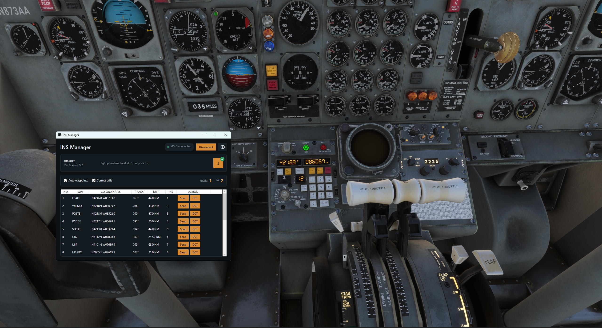

# User guide

## Requirements

- Microsoft Flight Simulator 2024
- FlightSim Studio Boeing 727
- A generated SimBrief flight plan
- Your SimBrief Pilot ID

INS Manager officially supports MSFS 2024. MSFS 2020 may work but is not tested.



## Start a flight

1. Start MSFS and load the FSS 727 into a flight.
2. Open INS Manager.
3. Open Settings.
4. Enter your SimBrief Pilot ID.
5. Select the FSS Boeing 727.
6. Choose a theme and drift correction interval.
7. Save the settings.
8. Select **Connect**.
9. Select the download button beside SimBrief.

The route table shows each waypoint, CIVA-formatted coordinates, inbound track, leg distance, and assigned INS slot.

## Load waypoints

Select **Send** beside a waypoint, choose a slot from 1 to 9, then confirm.

With **Auto waypoints** enabled, INS Manager fills the remaining slots with the next route waypoints. The active FROM and TO slots are not overwritten.

The app reads all nine aircraft slots every five seconds. If a cockpit entry matches a waypoint in the downloaded route, the table updates its INS assignment. Entries outside the route remain manual entries.

## Automatic slot management

INS Manager reads FROM, TO, and accuracy every second.

When the active leg advances, the app refills available slots with later route waypoints. For example:

- At `8 → 9`, slots 1 through 7 are prepared with the next route legs.
- At `9 → 1`, slot 8 receives the next required waypoint.

Disable **Auto waypoints** to manage all slots from the cockpit.

## Direct-to

1. Select **DCT** beside the required waypoint.
2. Confirm the waypoint in the dialog.

If the waypoint is not loaded, the app loads it into an available slot before setting FROM and TO.

## Drift correction

Enable **Correct drift** to update the CIVA navigation position from the aircraft position.

The correction runs when the app connects and then at the selected interval:

- 10 minutes
- 30 minutes
- 60 minutes

The displayed accuracy index comes from the aircraft. Correcting the position does not replace the FSS accuracy model.

## Coordinate format

Coordinates use degrees and decimal minutes, matching the CIVA display.

Example:

```text
N4216.8 W08703.8
```

This is the same position as `42.2794, -87.0633` in decimal degrees.

## Disconnect and close

Select **Disconnect** before changing aircraft or returning to the main menu.

Closing the window stops the SimConnect connection and exits the process. If INS Manager is already running, a second launch shows a warning and exits.

## Troubleshooting

### Connection fails

Confirm that MSFS is running and the FSS 727 is loaded into a flight. Then select **Connect** again.

### SimBrief download fails

Confirm the Pilot ID in Settings and generate a current flight plan on SimBrief.

### A route waypoint shows no INS slot

Wait five seconds for the next aircraft slot refresh. A manually entered coordinate must be within 0.25 NM of the SimBrief waypoint to be matched.

### FROM and TO do not update

Disconnect and reconnect the app. If the aircraft values still differ, report the displayed values and FSS 727 version in a GitHub issue.
